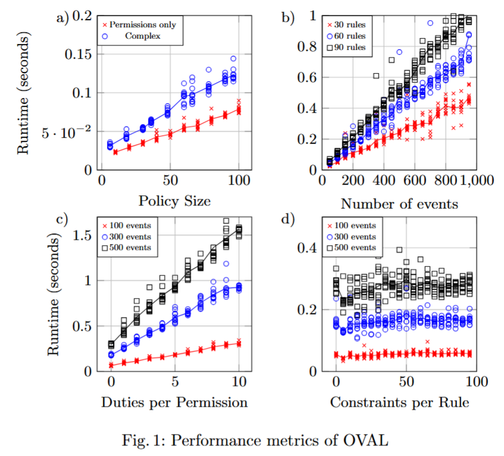

# Policy Engine and Evaluator

The Policy Engine provides a suite of functionality to inspect, process and use ODRL policies.

## **Main Goal/Functionalities**

Currently the following main functionalities are supported: 

* Visualising an ODRL policy to inspect it
* Validating the correctness of an ODRL policy file against the specification
* Evaluating one or more ODRL policies against a State of the World (like an event log, or a data access request)
* Generating synthetic ODRL policies, and generating synthetic States of the World about policies to be used for testing purposes.

## **How To Install**

### Requirements

Python, rdflib, pyshacl, pandas, matplotlib

## Usage

### Jupiter Notebook Interface

You can easily test the functions of this Policy Engine using the Jupiter Notebook `colab_notebook.ipynb`. This notebook is compatible with Google Colab, and contains instructions on how to use it. 

### Programmatic use

Currently the Policy Engine can be inported as a Python library to use its main functions.

The main functions can be found in the following files (more details in the code):

`validate.py`
* `validate_SHACL`
* `get_ODRL_macro_statistics`
* `describe_ODRL_statistics`
* `diagnose_ODRL`
* `generate_ODRL_diagnostic_report`

`rdf_utils.py`
* `parse_string_to_graph`
* `load`

`ODRL_Evaluator.py`
* `evaluate_ODRL_on_dataframe` core ODRL evaluation function, which takes as inputs an ODRL policy, a state of the world/event stream batch/access request, and optionally a previous saved state of the evaluation json object (this last parameter is only needed in online/stream evaluation) 
* `evaluate_ODRL_from_files` wrapper of the function above, which loads the inputs from files instead of using in-memory objects
* `evaluate_ODRL_from_files_merge_policies` utility function that allows for the processing of multiple policies at once, by merging their rules into a single policy
* `evaluate_ODRL_from_files_streaming` variant test function, that simulates streaming of events by breaking down a single large state of the world into multiple batches, by default containing 1 event each, and evaluates them sequentially 

`ODRL_generator.py`
* `generate_ODRL`

`SotW_generator.py`
* `extract_features_list_from_policy`
* `extract_rule_list`
* `extract_rule_list_from_policy`
* `extract_rule_list_from_policy_from_file`
* `generate_pd_state_of_the_world_from_policies`
* `generate_state_of_the_world_from_policies`
* `extract_features_list_from_policy_from_file`
* `generate_state_of_the_world_from_policies_from_file`

## Internal JSON data model

For ease of computation, ODRL rules are converted internally to a simplified JSON format.

For example, the following ODRL policy (adapted from an example in the ODRL 2.2 specification):

```
{
    "@context": "http://www.w3.org/ns/odrl.jsonld",
    "@type": "Agreement",
    "uid": "http://example.com/policy:66",
    "profile": "http://example.com/odrl:profile:09",
    "permission": [{
        "target": "http://example.com/data:77",
        "assigner": "http://example.com/org:99",
        "assignee": "http://example.com/person:88",
        "action": "distribute",
		"constraint": [{
           "leftOperand": "dateTime",
           "operator": "gt",
           "rightOperand":  { "@value": "2018-01-01", "@type": "xsd:date" }
       }],
        "duty": [{
            "action": "attribute",
            "attributedParty": "http://australia.gov.au/",
				"constraint": [{
			   "leftOperand": "dateTime",
			   "operator": "lt",
			   "rightOperand":  { "@value": "2028-01-01", "@type": "xsd:date" }
		   }],
            "consequence": [{
               "action": "acceptTracking",
               "trackingParty": "http://example.com/dept:100",
			   "constraint": [{
				   "leftOperand": "dateTime",
				   "operator": "lt",
				   "rightOperand":  { "@value": "2030-01-01", "@type": "xsd:date" }
			   }]
            },
			{
               "action": "acceptTracking",
               "trackingParty": "http://example.com/dept:120",
			   "constraint": [{
				   "leftOperand": "dateTime",
				   "operator": "lt",
				   "rightOperand":  { "@value": "2030-01-01", "@type": "xsd:date" }
			   }]
            }
			]
        }]
    }]
}
```

Is encoded in the following object:

```
[{'policy_iri': 'http://example.com/policy:66',
  'permissions': [{'conditions': [['http://www.w3.org/ns/odrl/2/Party', '=', 'http://example.com/person:88'],
                                  ['http://www.w3.org/ns/odrl/2/Action', '=', 'http://www.w3.org/ns/odrl/2/distribute'],
                                  ['http://www.w3.org/ns/odrl/2/Asset', '=', 'http://example.com/data:77'],
                                  ['http://www.w3.org/ns/odrl/2/dateTime', '>', '2018-01-01']],
                   'duties': [{'conditions': [['http://www.w3.org/ns/odrl/2/Action',
                                               '=',
                                               'http://www.w3.org/ns/odrl/2/attribute'],
                                              ['http://www.w3.org/ns/odrl/2/dateTime', '<', '2028-01-01']],
                               'consequences': [{'conditions': [['http://www.w3.org/ns/odrl/2/Action',
                                                                 '=',
                                                                 'http://www.w3.org/ns/odrl/2/acceptTracking'],
                                                                ['http://www.w3.org/ns/odrl/2/dateTime',
                                                                 '<',
                                                                 '2030-01-01']]},
                                                {'conditions': [['http://www.w3.org/ns/odrl/2/Action',
                                                                 '=',
                                                                 'http://www.w3.org/ns/odrl/2/acceptTracking'],
                                                                ['http://www.w3.org/ns/odrl/2/dateTime',
                                                                 '<',
                                                                 '2030-01-01']]}]}]}],
  'prohibitions': [],
  'obligations': []}]
```

## How to test for correctness

To test, run the `test.py` script. After the tests are run, the output of the tests will be print to console. 

The main test routine checks each main feature of the evaluator against curated test cases, and outputs the number of 
tests passed, along with the average time for evaluation. It also tests the streaming capabilities of the evaluator
by using simulating streaming using the `evaluate_ODRL_from_files_streaming` function.

### How to add evaluation tests

To add an evaluation test, create the following files, where X is a filename of your choosing 
(make sure this name is unique in the folder you will copy them in):
* `X.ttl` (a Turtle file containing a single ODRL policy)
* `X.csv` (a State of the World)
* `X.txt` (optional file, with information about the test)

If this is a test that should result in a "valid" output (if the ODRL policy in X.ttl is valid in State of the World X.csv) 
place the files under `test_cases\evaluation\valid`, 
otherwise under `test_cases\evaluation\invalid`.

Tests placed here will be run automatically when `test.py` is run.

In the X.txt file you can optionally add additional information about your test:
* First line: you can add here a message describing the test, which will be printed if the test fails
* Second line: you can add here a single keyword, to group similar types of tests together. The test output will show a breakdown for each keyword.

## How to perform scalability tests

To reproduce scalability results, run the `scalability_tests_all.py` script. This script will run all the scalability tests, 
output the results in CSV format, and lastly generate some plots from them for a quick inspection of the results.
When running the script, output files will be found in the `test_results` subfolder. Pre-generated results can be found in the `test_results_sample` subfolder.

To speed up the tests, you can reduce the `TEST_REPETITIONS` parameter in `scalability_tests.py`. More repetitions result
in more informative averages, but take more time to be processed.

### How to manually perform scalability tests

Scalability tests can be run using the `scalability_tests.py` script. Inside the file, there are various fixed parameters for the experiments such as TEST_REPETITIONS, STATE_SIZE_START, etc.

To run scalability tests, run `scalability_tests.py` with one of the following commands depending on which metric you want to measure:

* DUTIES for the number of duties per permission
* SOTW for the size of the states of the world
* CONSTRAINTS for the number of constraints per rule
* POLICY for the total number of rules per policy (split between permissions, permissions and prohibitions, and permissions and obligations)
* COMPLEX for complex policies with permissions, prohibitions, obligations, duties, remedies, etc.

### Example

For example, to reproduce the results in the following graph:



Unless specified, all parameters are set to their default values:

```python
STATE_SIZE_START = 50
STATE_SIZE_END = 1000
STATE_SIZE_STEP = 50

FIXED_PERMISSION_RULES = 10
FIXED_PROHIBITION_RULES = 10
FIXED_OBLIGATION_RULES = 10


# ---- plot 2 parameters ----
POLICY_SIZE_START = 5
POLICY_SIZE_END = 50
POLICY_SIZE_STEP = 5

FIXED_STATE_SIZE = 100

# ---- general parameters ----
TEST_REPETITIONS = 10

CONSTRAINT_NUMBER_MIN = 0
CONSTRAINT_NUMBER_MAX = 100
CONSTRAINT_NUMBER_STEP = 5
CONSTANTS_PER_FEATURE = 6
FIXED_CONSTRAINT_NUMBER = 1

PERMISSIONS_WITH_DUTIES = 100
DUTIES_PER_PERMISSION = 0
DUTIES_PER_PERMISSION_MIN = 0
DUTIES_PER_PERMISSION_MAX = 10

CONSEQUENCE_PER_PERMISSION = 1
REMEDIES_PER_PROHIBITION = 0
PROHIBITIONS_WITH_REMEDIES = 100

CHANCE_FEATURE_NULL = 0.5
CHANCE_FEATURE_EMPTY = 0.5

ONTOLOGY_PATH = "sample_ontologies/ODRL_DPV.ttl"
```
`

#### Graph a)

For graph a) to get the results shown in red, set the following parameters:
* POLICY_SIZE_START = 10
* POLICY_SIZE_END = 100
* POLICY_SIZE_STEP = 10
* FIXED_STATE_SIZE = 100
* PERMISSIONS_WITH_DUTIES = 0

And run `python scalability_tests.py POLICY`

This will produce a number of result files, of which "permissions.csv" will contain the results shown in red.

To get the results shown in blue, set the following parameters:
* POLICY_SIZE_START = 5
* POLICY_SIZE_END = 50
* POLICY_SIZE_STEP = 5
* FIXED_STATE_SIZE = 100
* PERMISSIONS_WITH_DUTIES = 100
* DUTIES_PER_PERMISSION = 1
* CONSEQUENCE_PER_PERMISSION = 1
* PROHIBITIONS_WITH_REMEDIES = 100
* REMEDIES_PER_PROHIBITION = 1

And run `python scalability_tests.py COMPLEX`

This will produce a file "all.csv" that contain the results shown in blue.

#### Graph b) 
For graph b) set the parameters to:
* STATE_SIZE_START = 100
* STATE_SIZE_END = 1000
* STATE_SIZE_STEP = 50
* DUTIES_PER_PERMISSION = 0
* REMEDIES_PER_PROHIBITION = 0

And depending on the colour of the results, FIXED_PERMISSION_RULES, FIXED_PROHIBITION_RULES and FIXED_OBLIGATION_RULES should be 10, 20 or 30 for red, blue and black, respectively.

Then, running `python scalability_tests.py SOTW` will produce a file "sotw.csv" that contains the results in the graph.

#### Graph c)
For graph c) set the parameters to:
* DUTIES_PER_PERMISSION_MIN = 0
* DUTIES_PER_PERMISSION_MAX = 10
* PERMISSIONS_WITH_DUTIES = 10

And depending on the colour of the results, FIXED_STATE_SIZE should be set to 100, 300 or 500 for red, blue and black, respectively.

Then, running `python scalability_tests.py DUTIES` will produce a file "duties.csv" that contains the results in the graph.

#### Graph d)
For graph d) set the parameters to:
* CONSTRAINT_NUMBER_MIN = 0
* CONSTRAINT_NUMBER_MAX = 100
* CONSTRAINT_NUMBER_STEP = 5

And depending on the colour of the results, FIXED_STATE_SIZE should be set to 100, 300 or 500 for red, blue and black, respectively.

Then, running `python scalability_tests.py CONSTRAINTS` will produce a file "constraints.csv" that contains the results in the graph.
