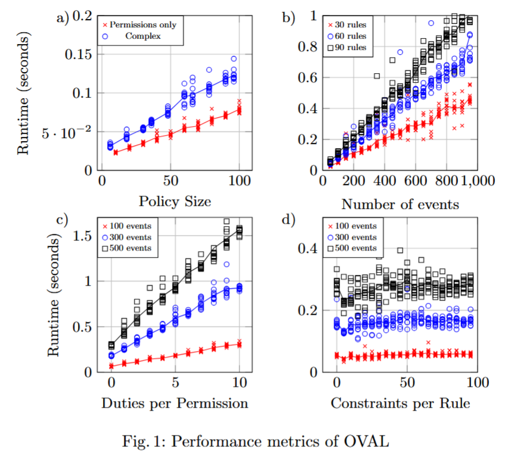

# Experimental Evaluation

The results of an experimental evaluation of the OVAL ODRL Evaluator can be found [in this article](https://arxiv.org/abs/2607.15987). Details on how to replicate these results, or perform additional experiments, is described below.

## How to perform scalability tests

To reproduce scalability results, run the `scalability_tests_all.py` script. This script will run all the scalability tests, 
output the results in CSV format, and lastly generate some plots from them for a quick inspection of the results.
When running the script, output files will be found in the `test_results` subfolder. Pre-generated results can be found in the `test_results_sample` subfolder.

To speed up the tests, you can reduce the `TEST_REPETITIONS` parameter in `scalability_tests.py`. More repetitions result
in more informative averages, but take more time to be processed.

### How to manually perform scalability tests

Scalability tests can be run using the `scalability_tests.py` script. Inside the file, there are various fixed parameters for the experiments such as TEST_REPETITIONS, STATE_SIZE_START, etc.

To run scalability tests, run `scalability_tests.py` with one of the following commands depending on which metric you want to measure:

* DUTIES for the number of duties per permission
* SOTW for the size of the states of the world
* CONSTRAINTS for the number of constraints per rule
* POLICY for the total number of rules per policy (split between permissions, permissions and prohibitions, and permissions and obligations)
* COMPLEX for complex policies with permissions, prohibitions, obligations, duties, remedies, etc.

### Example

For example, to reproduce the results in the following graph:



Unless specified, all parameters are set to their default values:

```python
STATE_SIZE_START = 50
STATE_SIZE_END = 1000
STATE_SIZE_STEP = 50

FIXED_PERMISSION_RULES = 10
FIXED_PROHIBITION_RULES = 10
FIXED_OBLIGATION_RULES = 10


# ---- plot 2 parameters ----
POLICY_SIZE_START = 5
POLICY_SIZE_END = 50
POLICY_SIZE_STEP = 5

FIXED_STATE_SIZE = 100

# ---- general parameters ----
TEST_REPETITIONS = 10

CONSTRAINT_NUMBER_MIN = 0
CONSTRAINT_NUMBER_MAX = 100
CONSTRAINT_NUMBER_STEP = 5
CONSTANTS_PER_FEATURE = 6
FIXED_CONSTRAINT_NUMBER = 1

PERMISSIONS_WITH_DUTIES = 100
DUTIES_PER_PERMISSION = 0
DUTIES_PER_PERMISSION_MIN = 0
DUTIES_PER_PERMISSION_MAX = 10

CONSEQUENCE_PER_PERMISSION = 1
REMEDIES_PER_PROHIBITION = 0
PROHIBITIONS_WITH_REMEDIES = 100

CHANCE_FEATURE_NULL = 0.5
CHANCE_FEATURE_EMPTY = 0.5

ONTOLOGY_PATH = "sample_ontologies/ODRL_DPV.ttl"
```
`

#### Graph a)

For graph a) to get the results shown in red, set the following parameters:
* POLICY_SIZE_START = 10
* POLICY_SIZE_END = 100
* POLICY_SIZE_STEP = 10
* FIXED_STATE_SIZE = 100
* PERMISSIONS_WITH_DUTIES = 0

And run `python scalability_tests.py POLICY`

This will produce a number of result files, of which "permissions.csv" will contain the results shown in red.

To get the results shown in blue, set the following parameters:
* POLICY_SIZE_START = 5
* POLICY_SIZE_END = 50
* POLICY_SIZE_STEP = 5
* FIXED_STATE_SIZE = 100
* PERMISSIONS_WITH_DUTIES = 100
* DUTIES_PER_PERMISSION = 1
* CONSEQUENCE_PER_PERMISSION = 1
* PROHIBITIONS_WITH_REMEDIES = 100
* REMEDIES_PER_PROHIBITION = 1

And run `python scalability_tests.py COMPLEX`

This will produce a file "all.csv" that contain the results shown in blue.

#### Graph b) 
For graph b) set the parameters to:
* STATE_SIZE_START = 100
* STATE_SIZE_END = 1000
* STATE_SIZE_STEP = 50
* DUTIES_PER_PERMISSION = 0
* REMEDIES_PER_PROHIBITION = 0

And depending on the colour of the results, FIXED_PERMISSION_RULES, FIXED_PROHIBITION_RULES and FIXED_OBLIGATION_RULES should be 10, 20 or 30 for red, blue and black, respectively.

Then, running `python scalability_tests.py SOTW` will produce a file "sotw.csv" that contains the results in the graph.

#### Graph c)
For graph c) set the parameters to:
* DUTIES_PER_PERMISSION_MIN = 0
* DUTIES_PER_PERMISSION_MAX = 10
* PERMISSIONS_WITH_DUTIES = 10

And depending on the colour of the results, FIXED_STATE_SIZE should be set to 100, 300 or 500 for red, blue and black, respectively.

Then, running `python scalability_tests.py DUTIES` will produce a file "duties.csv" that contains the results in the graph.

#### Graph d)
For graph d) set the parameters to:
* CONSTRAINT_NUMBER_MIN = 0
* CONSTRAINT_NUMBER_MAX = 100
* CONSTRAINT_NUMBER_STEP = 5

And depending on the colour of the results, FIXED_STATE_SIZE should be set to 100, 300 or 500 for red, blue and black, respectively.

Then, running `python scalability_tests.py CONSTRAINTS` will produce a file "constraints.csv" that contains the results in the graph.
