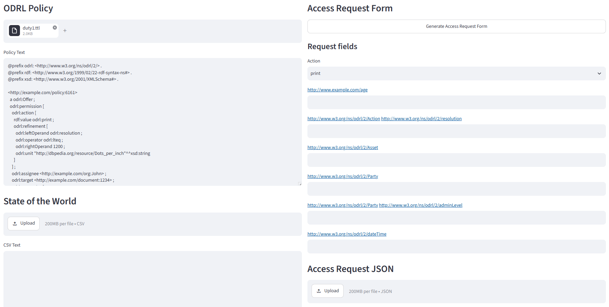
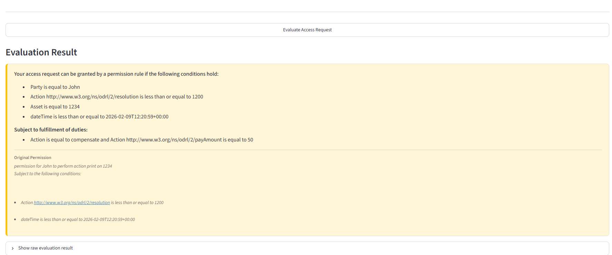
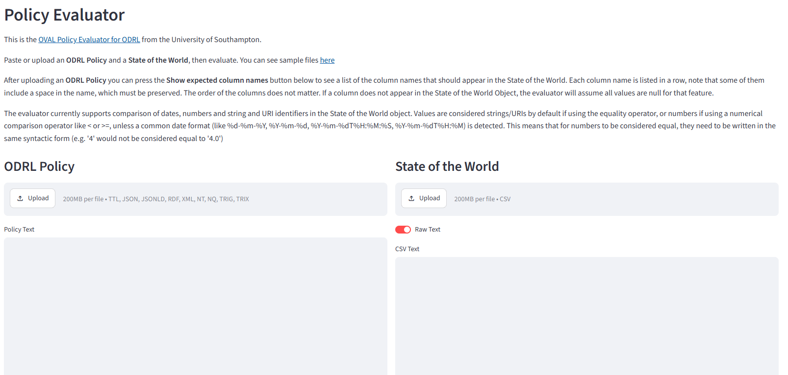
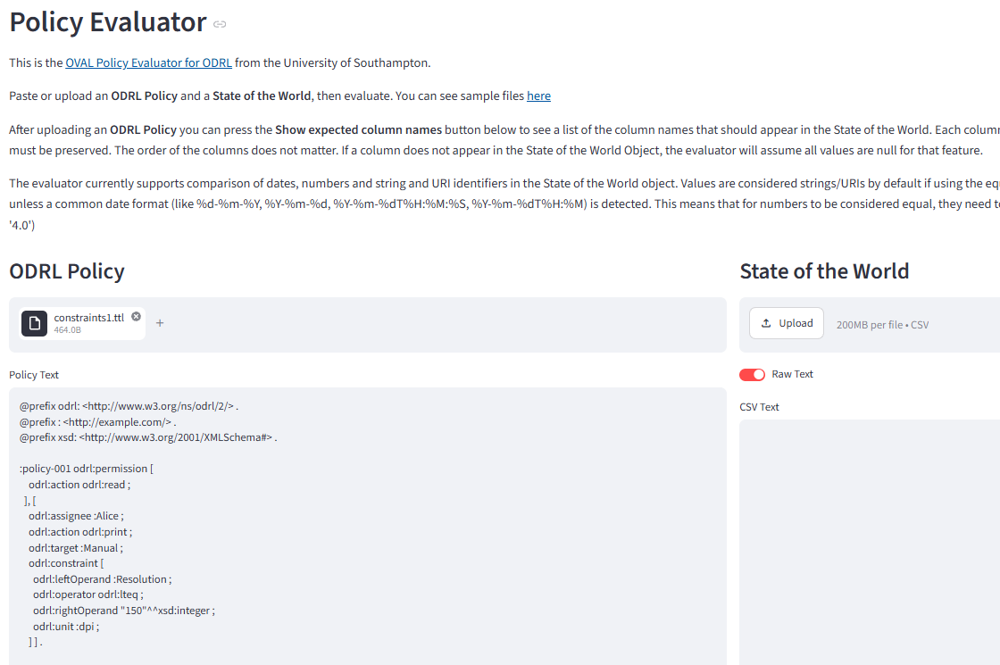
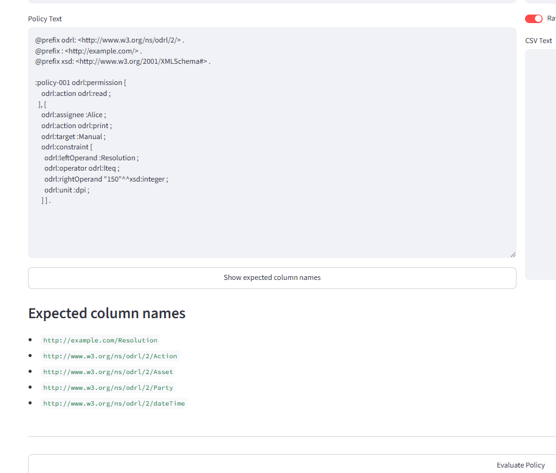
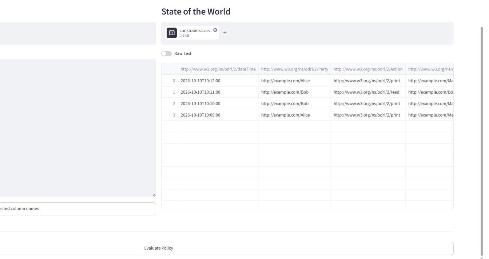
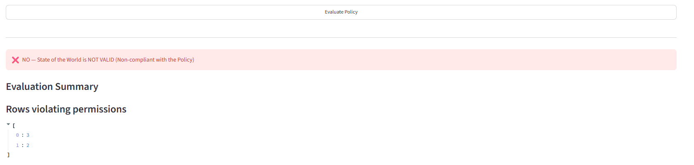

# OVAL Evaluator User Guide

These guides explains how to use the OVAL evaluator. The main inputs for the Evaluation functions are:
* An ODRL Policy
* A State of the World CSV file (described below)
* Optionally, an Evaluation State file (described below)

#### Reasoning

Unless disabled (disabling the `reasoning` flag in the evaluator functions, the OVAL evaluator will include reasoning.
Included modes of reasoning are `odrl:includedIn` and `odrl:partOf`, these allow you to specify sub-actions, or 
members of parties or assets. The evaluation functions can be configured to include a list of ontology files. Even if 
this list is empty, the ontologies considered will include the ODRL 2.2 ontology, and any ontological information in the 
policy itself. The latter is a convenience feature to be able to process both a policy and an ontology with a single RDF file.
For example, a policy could also contain information about new actions, and which super-actions they are included in, and
which parties or assets are part of collections.

#### Data Format of a State of the World

States of the World objects must be CSV files containing a number of columns matching the components and left operands
used in the policy. The GUI and API have methods to compute the list of the column names that should appear in the 
State of the World. Note that some of the column names include a space in the name, which must be preserved. 
The order of the columns does not matter. If a column does not appear in the State of the World Object, 
the evaluator will assume all values are null for that feature.

Cells in the CSV file must contain either identifiers (strings or IRIs), numbers, or dates.
Please see the [Evaluator Feature Support](../../../documentation/evaluator_feature_support.md) for more details on the supported
ODRL features and the support for those data types.

#### Data Format of the Evaluation State File

An Evaluation State file is created automatically after every evaluation. It is essentially a copy of the policy, in JSON
format, annotated with additional information, such as whether a rule matched an event, when, or whether an obligation/consequence/remedy
is flagged as being required for compliance. This Evaluation State file is only needed if you want to evaluate compliance
over a stream of events. In this case, there is no need to re-evaluate old events, and you can continue evaluation on new
events by adding the latest Evaluation State object as an optional input to the next evaluation. Using this approach, you
can evaluate one event at a time, and the result will be the same as if you had evaluated all events at once.
This assumes that events are evaluated in chronological order.

The evaluation guides provided are:

* Evaluating a Policy For Access Control Through the GUI
* Evaluating a Policy For Access Control Programmatically through Python
* Evaluating a Policy for Monitoring Through the GUI
* Evaluating a Policy for Monitoring Through the API
* Evaluating a Policy for Monitoring Programmatically through Python

## Evaluating a Policy For Access Control Through the GUI

_Last Updated 26/08/2026_

After installation, open the Access Request Evaluator app (by default http://localhost:8031/evaluator-of-access-requests/ on a localhost docker deployment)
 
1) Upload an ODRL Policy
2) Optionally, upload a State of the World object if you want to factor in previously executed duties.
3) Fill in the `Access Request Form`, to specify the action you want permission for.
4) As an alternative to 3), you can upload an access request as a JSON file.

5) Press the `Evaluate Access Request` button
6) The result of the evaluation of the access request will be shown below. Green and Red reports signify permissions
or prohibitions that directly affect your request. Yellow reports signify permissions and prohibitions that might
affect your access request, depending on certain conditions. For example, a prohibition might only apply if the value
of a feature you left blank has a value sufficiently low, or a permission might apply only if you are going to fulfill
a certain duty.

## Evaluating a Policy For Access Control Programmatically through Python

_Last Updated 26/08/2026_

* Obtain the Policy file, the access request JSON file, (optionally) State of the World file and (optionally) Evaluation State file to be used as inputs.
* Make sure you have Python and all the modules of requirements.txt available.
* Clone the project and in your python function import the `ODRL_Evaluator.py` script
* Call the function `ODRL_Evaluator.evaluate_ODRL_access_request_from_files`
* Call function `evaluate_ODRL_access_request_from_strings` if you want to pass raw strings as input.

## Evaluating a Policy for Monitoring Through the GUI

_Last Updated 25/08/2026_

A video walktrough of this example is available [here](../../../resources/Policy_Evaluation_Demo_July_2026.mp4).

You try a live version on on [DIPS](https://dips.soton.ac.uk/odrl-engine/odrl-engine-dashboard/).

* After installation, open the Monitoring Evaluator app (by default http://localhost:8031/evaluator-for-monitoring/ on a localhost docker deployment)

* Click the "Upload" button under "ODRL Policy" and upload an RDF file containing an ODRL policy 
(in any RDF serialisation), for example [this policy](../../../test_cases/evaluation/invalid/constraints1.ttl)

* Optionally, view the required features for this policy. These are the column names that the evaluator
will look for in the State of the World to evaluate the log of events.

* Click the "Upload" button under "State of the World" and upload a CSV file containing the State of the World with the
required column names (the order of the columns does not matter, and there can be extra columns). The State of the World
from the example can be found [here](../../../test_cases/evaluation/invalid/constraints1.csv).

* Click the "Evaluate Policy" button. The result of the evaluation will be displayed below. If there are violations, the
list of events violating a given type of rule will be displayed as a list of indexes (the indexes of the violating rows).
If there are rules that are violated, like missing obligations, these will also be displayed below.

## Evaluating a Policy Through the API

_Last Updated 25/08/2026_

* Obtain the Policy file, State of the World file and (optionally) Evaluation State file to be used as inputs.
* You can try an API call using the Swagger API (http://localhost:8031/api/docs on a localhost docker installation), 
or by directly calling the API (http://localhost:8031/api/evaluate_policy_on_sotw)
* Pass the string content of the Policy file, State of the World file and (optionally) Evaluation State file
as the `policy`, `sotw` and `evaluation_state` fields (respectively) of the request object.
* The API call will return a JSON object as a return value, and the boolean result of the compliance check can be found
in the `valid` field.

Please see the [Swagger documentation](https://dips.soton.ac.uk/odrl-engine/api/docs#/default/evaluate_policy_on_sotw_evaluate_policy_on_sotw_post) for more details on the inputs and outputs of functions, the schema of the datatypes
and examples.

## Evaluating a Policy Programmatically through Python

_Last Updated 25/08/2026_

* Obtain the Policy file, State of the World file and (optionally) Evaluation State file to be used as inputs.
* Make sure you have Python and all the modules of requirements.txt available.
* Clone the project and in your python function import the `ODRL_Evaluator.py` script
* Call the function `ODRL_Evaluator.evaluate_ODRL_from_files` with the path to the policy file, State of the World file
  (and optionally Evaluation State file) as input.
* Call function `evaluate_ODRL_from_strings` if you want to pass raw strings as input.