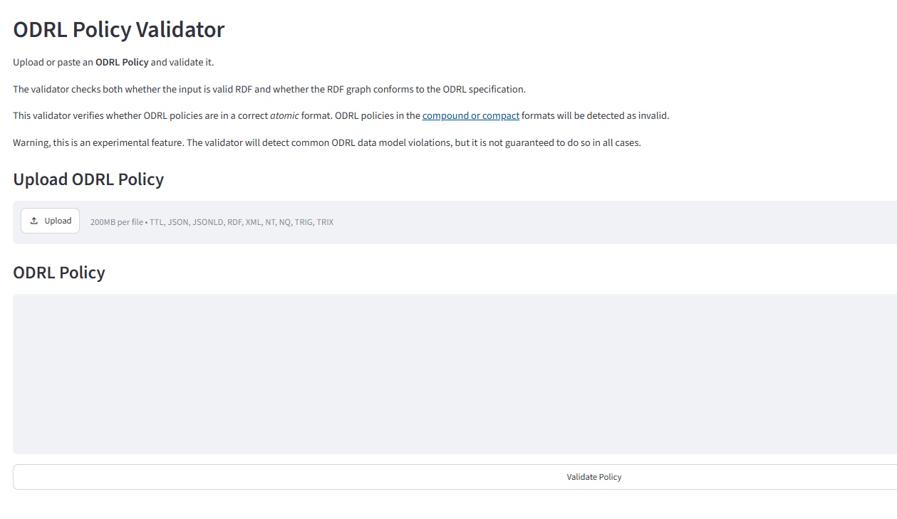
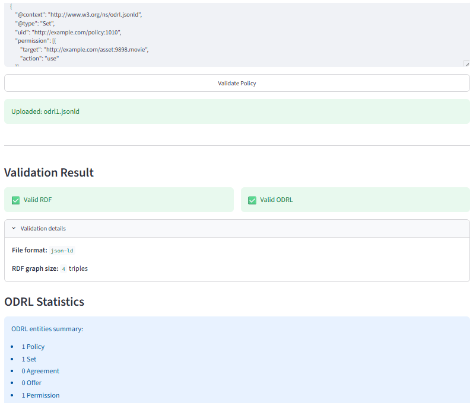
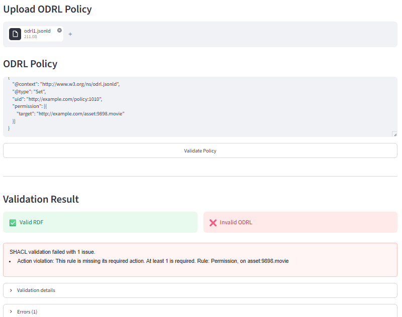

# DIPS Validator User Guide

These guides explain how to use the DIPS Validator.

The evaluation guides provided are:
* Validate an ODRL Policy through the GUI
* Validate an ODRL Policy through the API
* Validate an ODRL Policy Programmatically in Python

## Validate an ODRL Policy through the GUI

_Last Updated 25/08/2026_

You try a live version on on [DIPS](https://dips.soton.ac.uk/odrl-engine/odrl-engine-dashboard/).

* Open the Validator app.

* Click on the "Upload" button and upload the ODRL file to validate (it can contain multiple policies)
* Optionally, edit the policy in the text field.
* Click on "Validate Policy"
* The validation result will appear below the "Validate Policy" button. It will say whether the file you
have uploaded is valid RDF, and if so, whether all the policies contained validate the rules (defined in a [SHACL document](../../../SHACL/odrl-shacl.ttl))
* If the ODRL is valid, macro statistics of the policies (like the number of rules) will be displayed.
 
* If the ODRL is not valid, the SHACL validation report will be returned, along with a more human readable summary.
 

## Validate an ODRL Policy through the API

_Last Updated 25/08/2026_

* You can try an API call using the Swagger API (http://localhost:8031/api/docs on a localhost docker installation), 
or by directly calling the API (http://localhost:8031/api/validate_ODRL)
* Pass the string content of the Policy file as the `odrl` field of the payload.
* The function will return a validation report in a JSON object, with RDF and ODRL validation in fields `is_valid_RDF` 
and `is_valid_ODRL`

## Validate an ODRL Policy Programmatically in Python

_Last Updated 25/08/2026_

* Obtain the Policy file you want to use as input
* Make sure you have Python and all the modules of requirements.txt available.
* Clone the project and in your python function import the `validate.py` script
* Call the function `validate.validate_ODRL_from_file` with the path to the policy file as input
* Call function `validate_ODRL_from_string` or `validate_ODRL` 
if you want to pass raw strings or an rdflib graph object (respectively) as input.